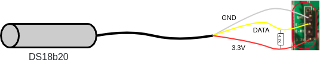
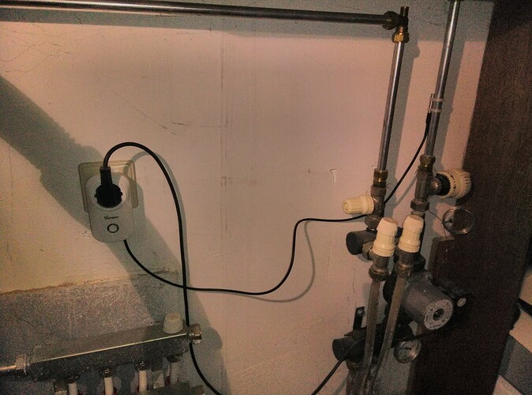

# Underfloor heating pump controller (DIY)

A underfloor heating system distributes warm water through tubes in the floor to heat up a room. An electrical pump drives the system. In some cases the pump runs 24/7. 

This is not really necessary and wastes a lot of energy. Instead, it should only run when there is a demand for heat in the room. In other words, only when the boiler is delivering warm water and we want to heat up this particular room, the pump should run. The controller presented here, addresses the following scenario's:

- Warm water enters the underfloor heating circulation system. The pump is turned on.
- Colder water enters the underfloor heating circulation system. The pump is turned off
- Warm water enters the system. An override is set and the pump will not be turned on

The project uses [Home Assistant](https://www.home-assistant.io/) and the beautifully integrated [ESPHome](https://esphome.io/) system. The hardware exists of a slightly modified Sonoff S20 with a ds18b20 temperature sensor. Both Sonoff S20 and the sensor are low priced items.

<table>
    <tr>
    <td align="center" style="width: 30%">
        
     </td>
     <td align="center" style="width: 30%">
        
     </td>
     <td align="center" style="width: 30%">
        
     </td>
     </tr>
</table>

## Saving energy

How much energy is wasted in case the pump is running 24/7? In my house, the pump is 60W. When running 24/7, it consumes 526 kWh a year. There is no demand for heat during summer, midweeks, midnights etc. Approximately 80% of a year the pump runs without a purpose. Energy loss of 421 kWh (100 Euro) a year. Knowing that our soloar panels generate about 1000 kWh a year, the energy loss is quite substantial.

This controller saves energy by running the pump only when warm water from the boiler enters the heating system.

Secondly, if the room is not occupied, the controller can be overridden to not run, even when the boiler is delivering warm water. Warm water will not be pushed through the tubes and the floor temperature will not increase. The controller acts now like a valve. This makes the controller suitable for multi-room climate control.

## Corrosion prevention

When a pump is not running for a longer time, it may become stuck due to corrosion. The controller has some logic for this to run the pump every midnight for a minute.

## Building the controller

Warning. This project requires changes to the Sonoff S20. Contact with live parts may cause shocks and burns. Building and using the controller is at your own risk. The build process exists of two steps. Adding a temperature sensor to the S20 and replacing the existing firmware.

### Sonoff S20 hardware modifications

In this section the DS18b20 will be added to the Sonoff S20. Don't solder the wires directly to the mainboard. Use a header instead. 

Open the S20 to get access to the main board. Take the mainboard out and solder an header as shown in the figure below. Drill a hole to guide the sensor wire through the S20 body. Solder the wires of the DS18B20 with the resistor on a connector. Isolate with insulation tape or shrink tube. [See this link](https://esphome.io/components/sensor/dallas.html). 

<table><tr>
<td align="center">
<figure>

<figcaption>Header Mainboard</figcaption>
</figure>
<td align="center">
<figure>

<figcaption>Pass through with glue</figcaption>
</figure>
<td align="center">
<figure>

<figcaption>Connector with resistor</figcaption>
</figure>
</tr>
<tr>
<td align="center" colspan="3">
<figure>

<figcaption>Wiring sensor and header inside S20</figcaption>
</tr></table>

### New firmware for the Sonoff S20

In this step the S20 will be flashed with new firmware. The provided source for the firmware can be found here [pump_controller.yaml](pump_controller.yaml). The controller requires ESPHome together with Home Assistant.

Copy the [pump_controller.yaml](pump_controller.yaml) file to the esphome folder. The controller requires four secrets, see the following code snippet. Specify the secrets in secrets.yaml.

``` yaml
wifi:
  ssid: !secret wifi_ssid
  password: !secret wifi_password

ota:
  password: !secret esphome_ota_password

# Enable logging
logger:

# Enable Home Assistant API
api:
  password: !secret ha_api_password
```

Comment out the Dallas address in the source code. The file is now ready to be compiled and flashed to the S20. Follow [this](https://esphome.io/devices/sonoff_s20.html) ESPHome guide. Please read carefully and take notice of the warnings.

<figure>

<figcaption>The final result</figcaption>
</figure>

Close the S20 case and check that it running as expected. When started, a green, slow blinking light, glows around the push button. 
Finally the address of the DS18b20 can be set in the source code as described in the ESPHome documentation for the Dallas component. Read the address from the ESPHome log and update the yaml file. Compile and flash again.

### the firmware in more detail

Plug-in the controller and Home Assistant will announce a new device with the following entities:

- A switch for selecting Automatic or Manual mode
- A Manual Control switch
- A sensor that holds the 'Threshold On' temperature
- A sensor that holds the 'Threshold Off' temperature
- A sensor that holds the actual water temperature
- A sensor that shows the state of the pump (running or not)

The controller operates in Manual or Automatic mode. In Manual mode, the pump is switched on or off by the Manual Control switch. 

In Automatic mode, the pump is switched on and off automatically. When the actual water temperature crosses the Threshold On, the pump will be switched on. In case the actual water temperature crosses the Threshold Off, the pump will be switched off. 

The manual mode is added to support the multi-room climate control. The S20 starts in automatic mode. The push button cycles between following settings:
1. Manual Mode - Manual Control switch Off
2. Manual Mode - Manual Control switch on
3. Automatic Mode

In case the connection with the network of Home Assistant is lost, the controller switches to Automatic Mode.

Both thresholds are set by calling a service. This will be covered in another section.

## Installing the controller

Installation is shown in the image below. The pump is plugged into the S20. The sensor is attached to the pipe in which warm water is entering the underfloor heating. Check this carefully, or your system will fail to work.

Two tie-wraps are used to mount the sensor.



## Home Assistant integration

The file [underfloor_heating_pump.yaml](underfloor_heating_pump.yaml) adds and synchronizes the sliders for both thresholds between Home Assistant and the controller. Thresholds are stored in controller and allows it to operate without Home Assistant being available.

The [lovelace](lovelace.yaml) file is an example how to integrate the controller in the ui. 

<figure>

<figcaption>Lovelace UI</figcaption>
</figure>

