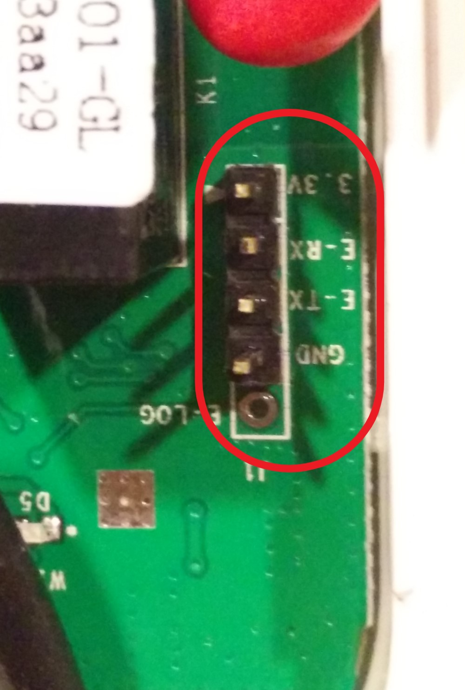
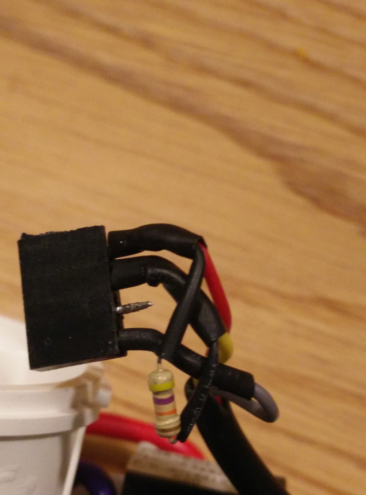
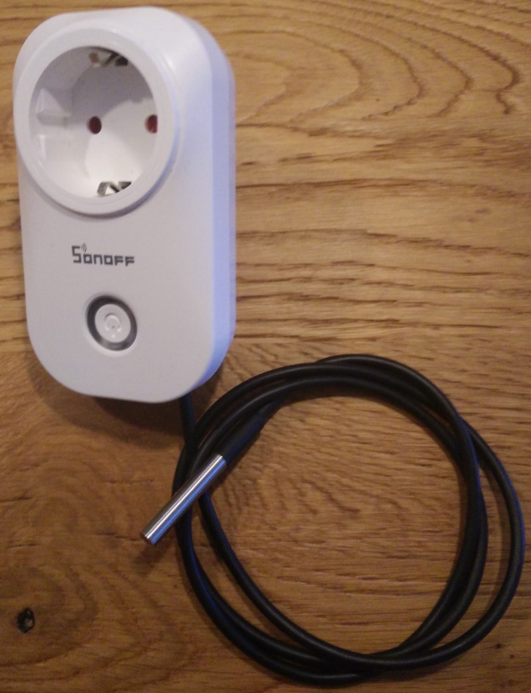

# Underfloor heating pump controller (DIY)

A underfloor heating system distributes warm water through tubes in the floor to heat up a room. An electrical pump drives the system. In some cases the pump runs 24/7. 

This is not really necessary and wastes a lot of energy. Instead, it should only run when there is a demand for heat in the room. In other words, only when the boiler is delivering warm water and we want to heat up this particular room, the pump should run. The controller presented here, addresses the following scenario's:

- Warm water enters the underfloor heating circulation system. The pump is turned on.
- Colder water enters the underfloor heating circulation system. The pump is turned off
- Warm water enters the system. An override is set and the pump will not be turned on

The project uses [Home Assistant](https://www.home-assistant.io/) and the beautifully integrated [ESPHome](https://esphome.io/) system. The hardware exists of a slightly modified Sonoff S20 with a ds18b20 temperature sensor. Both Sonoff S20 and the sensor are low priced items.

<table>
    <tr>
    <td align="center" style="width: 30%">
        
     </td>
     <td align="center" style="width: 30%">
        
     </td>
     <td align="center" style="width: 30%">
        
     </td>
     </tr>
</table>

## Saving energy

How much energy is wasted in case the pump is running 24/7? In my house, the pump is 60W. When running 24/7, it consumes 526 kWh a year. There is no demand for heat during summer, midweeks, midnights etc. Approximately 80% of a year the pump runs without a purpose. Energy loss of 421 kWh (100 Euro) a year. Knowing that our soloar panels generate about 1000 kWh a year, the energy loss is quite substantial.

This controller saves energy by running the pump only when warm water from the boiler enters the heating system.

Secondly, if the room is not occupied, the controller can be overridden to not run, even when the boiler is delivering warm water. Warm water will not be pushed through the tubes and the floor temperature will not increase. The controller acts now like a valve. This makes the controller suitable for multi-room climate control.

## Corrosion prevention

When a pump is not running for a longer time, it may become stuck due to corrosion. The controller has some logic for this to run the pump every midnight for a minute.

## Building the controller

Warning. This project requires changes to the Sonoff S20. Contact with live parts may cause shocks and burns. Building and using the controller is at your own risk.

### Sonoff S20 hardware modifications

Open the S20 to get access to the main board. Take the mainboard out and solder an header as shown in the figure below. Drill a hole to guide the sensor wire through the S20 body. Solder the wires of the DS18B20 with the resistor on the connector. Isolate with isolation tape or shrink tube. [See this link](https://esphome.io/components/sensor/dallas.html). 

<table><tr>
<td align="center">
<figure>

<figcaption>Header Mainboard</figcaption>
</figure>
<td align="center">
<figure>

<figcaption>Pass through with glue</figcaption>
</figure>
<td align="center">
<figure>

<figcaption>Connector with resistor</figcaption>
</figure>
</tr></table>

### Flash the S20

The firmware requires ESPHome. Copy the [pump_controller.yaml](pump_controller.yaml) file to the esphome folder. The controller requires four secrets. Specify the secrets in secrets.yaml. 

``` yaml
wifi:
  ssid: !secret wifi_ssid
  password: !secret wifi_password

ota:
  password: !secret esphome_ota_password

# Enable logging
logger:

# Enable Home Assistant API
api:
  password: !secret ha_api_password
```

Comment out the Dallas address. The file is now ready to be compiled and flashed to the S20. More details can be found [here](https://esphome.io/devices/sonoff_s20.html). Please read carefully and take notice of the warnings.

Close the S20 case and check that it running as expected. A green, slow blinking light, glows around the push button. Home Assistant announces a new device. Accept the device. The following entities are added automatically:

- Automatic or manual mode switch
- Pump on or off switch, which only operates in manual mode
- Threshold on sensor
- Threshold off sensor
- Actual water temperature 

The Dallas documentation states that it is better to use the sensor address. Read the address from the ESPHome log and update the yaml file. Compile and flash again.

<figure>

<figcaption>The final result</figcaption>
</figure>

This completes the step.

## Installing the controller


The S20 Wifi switch can be easily modified


